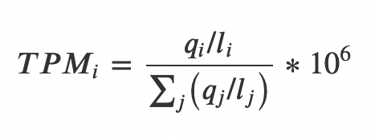
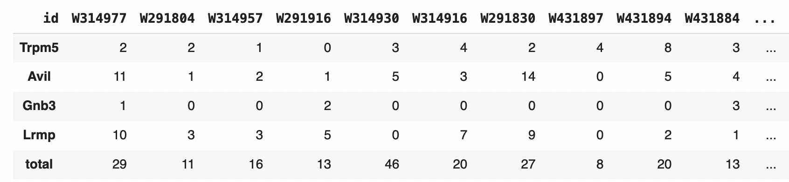
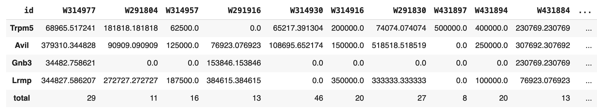

# hw4_scRNA-seq
Анализ scRNA-seq данных из статьи ["Single-cell mapping of the thymic stroma identifies IL-25-producing tuft epithelial cells"](https://drive.google.com/file/d/1PozBU0cxuXQIQcKqGvgZ-6-bQ1wxwD-2/view?usp=sharing)
## [Google Colab link](https://colab.research.google.com/drive/1Aq2B7r6gzBAMxI8udHeruYxEfhwalmN_?usp=sharing)
## scRNA-seq data normalization
### Method description
Для того, чтобы можно было сравнивать между собой разные образцы по уровню экспрессии определенных генов, необходимо провести нормализацию данных для каждого образца. В данной работе был использован один из самых простых методов - TPM (transcript per million). TPM рассчитывается по формуле представленной ниже:

В отдельном образце значение TPM для гена i равняется количеству чтений гена i “q(i)”, взвешенному на длину гена i “l(i)”, деленному на сумму чтений всех генов в образце, взвешенных на длины этих. Далее полученное значение TPM умножается на 10^6.
### Results
#### Data before normalization

#### Data after normalization

