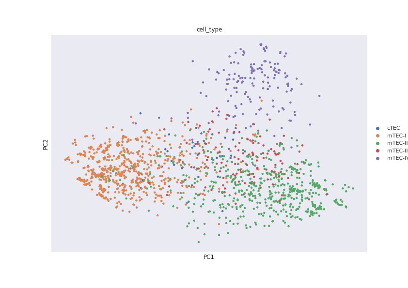
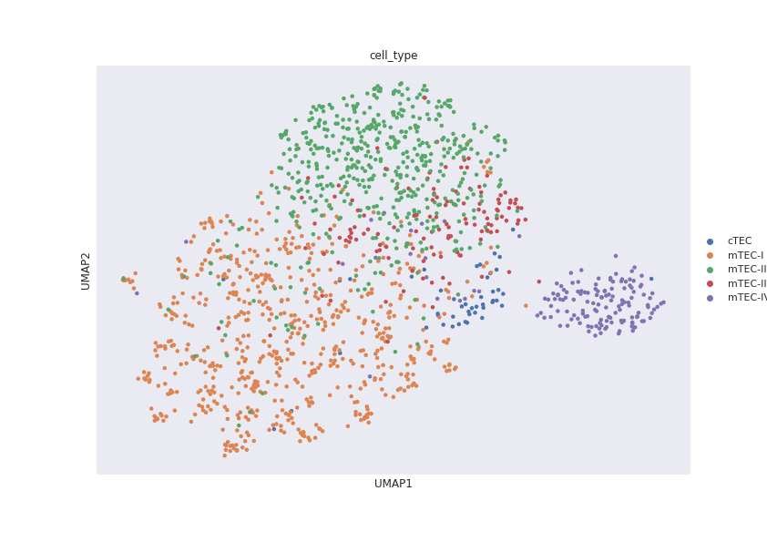
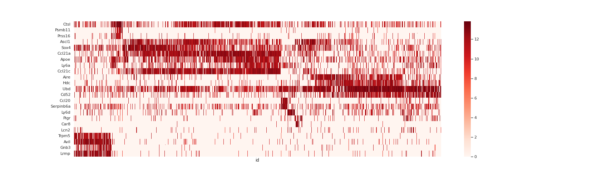
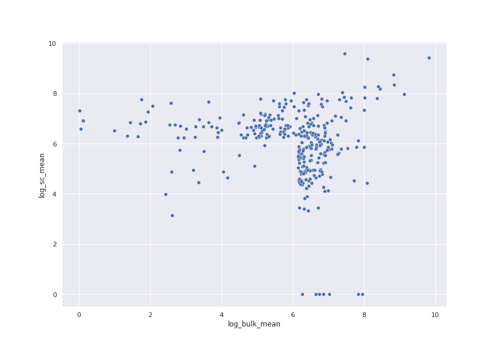
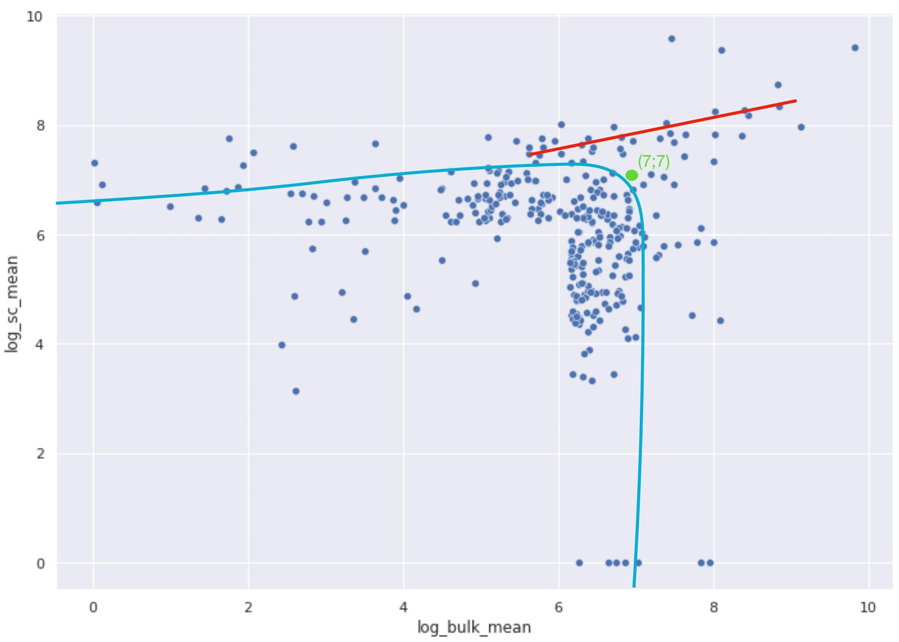
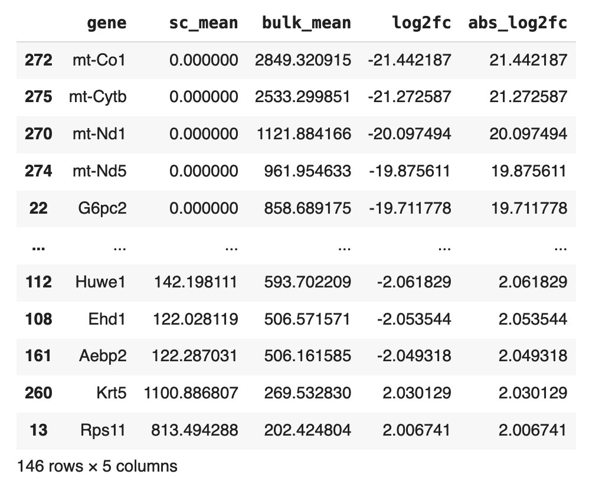

# hw4_scRNA-seq
Анализ scRNA-seq данных из статьи ["Single-cell mapping of the thymic stroma identifies IL-25-producing tuft epithelial cells"](https://drive.google.com/file/d/1PozBU0cxuXQIQcKqGvgZ-6-bQ1wxwD-2/view?usp=sharing)
## [Project code in Google Colab](https://colab.research.google.com/drive/1Aq2B7r6gzBAMxI8udHeruYxEfhwalmN_?usp=sharing)
## scRNA-seq data normalization
### Method description
Для того, чтобы можно было сравнивать между собой разные образцы по уровню экспрессии определенных генов, необходимо провести нормализацию данных для каждого образца. В данной работе был использован один из самых простых методов - TPM (transcript per million). TPM рассчитывается по формуле представленной ниже:

В отдельном образце значение TPM для гена i равняется количеству чтений гена i “q(i)”, взвешенному на длину гена i “l(i)”, деленному на сумму чтений всех генов в образце, взвешенных на длины этих. Далее полученное значение TPM умножается на 10^6 [[1]](https://translational-medicine.biomedcentral.com/articles/10.1186/s12967-021-02936-w).

В данной работе количества чтений генов не взвешивались на длины соотвествующих генов.
### Results
#### Data before normalization

#### Data after normalization

## Samples clusterization
На основе нормализованных данных генной экспрессии исследуемые образцы были кластеризованы. Для визуализации результатов кластеризации были использованы два распространённых метода понижения размерности: PCA и UMAP.
### PCA visualization

Из пяти клеточных типов, обозначенных разными цветами, две главные компоненты, полученные методом PCA, позволяют отчетливо отобразить только три типа, соответствующих оранжевому, зелёному и фиолетовому кластеру, в то время как синие и красные точки не образуют выраженных скоплений и смешиваются с другими типами клеток.
### UMAP visualization

Судя по графику, UMAP справился с понижением размерности до двух измерений заметно лучше, чем PCA: кроме выделения оранжевого, зелёного и фиолетового типов в виде более выраженных кластеров, UMAP сумел выделить отчетливый кластер для синего типа и некое подобие кластера для красного.
### Conclusion
Подводя итоги, UMAP показал себя лучше, чем PCA, и проиллюстрировал возможность сократить размерность данных до двух признаков с сохранением значительной части информации в нашей задаче. Следовательно, вполне вероятно, что количество маркерных генов, необходимых для дифференциации клеточных типов по данным экспрессии, может быть уменьшено без заметного ущерба в точности.
## Marker genes expression heatmap
На основе нормализованных данных об экспрессии 23 маркерных генов, отобранных авторами статьи, была получена тепловая карта. На ней по оси абсцисс отложены образцы, сгруппированные по клеточным типам, а по оси ординат - маркерные гены. На карте невооруженным глазом заметны отчетливые паттерны экспрессии генов, по которым можно отличить один клеточный тип от другого.

Ниже на карте выделены самые очевидные паттерны, соответсвующих разным клеточным типам.

## Bonus task
### Materials and methods
Для сравнения экспрессии генов между bulk RNA-seq и scRNA-seq были выполнены следующие шаги:
1. Две реплики RNA-seq эксперимента из статьи [Meredith et al, 2015](https://pubmed.ncbi.nlm.nih.gov/26237550/) были нормализованы тем же метолом, что и single cell данные.
2. Для обоих датасетов (bulk & s-cell) по каждому гену было найдено среднее значение TPM среди всех образцов.
3. Для сравнения было отобрано 318 генов, каждый из которых:
* Присутствовал в обоих датасетах (bulk & s-cell)
* Был либо среди маркерных генов, отображенных на heatmap выше, либо входил в топ-200 наиболее высоко-экспрессированных генов в bulk или scRNA.
4. Полученные преобразованные данные были использованы для построения диаграмм рассеяния и поиска дифференциально экспрессированных генов с помощью фильтрации по log2-fold change.
### Graphical analysis
Для графического анализа по усредненным нормализованным данным была построена диаграмма рассеяния в логарифмической шкале, где каждая точка соответсвует гену, а её координаты - средней экспрессии этого гена в bulk (ось OX) и s-cell (ось OY).

Если смотреть на график диагонально, начиная с верхнего правого угла, то можно заметить, что короткий линейный тренд быстро сменяется неким подобием гиперболической зависимости между результатами двух типов RNA-seq. Если отбросить немногочисленные выбросы, то можно сделать вывод о том, что в квадратной области, ограниченной координатными осями с левой стороны и прямыми, параллельными осям и пересекающимися в районе координаты (7; 7), с правой стороны, уровни экспрессии между двумя типами RNA-seq сильно расходятся (голубой график). В то время как данные за пределами описанного квадрата демонстрируют прямую корреляцию (красный график), как показано на следующем рисунке.

### Statistical analysis
DESeq2 и другие подобные ему инструменты для анализа дифференциальной экспресии чаще всего требуют на вход сырых данных об экспрессии в виде матрицы, в которой строки соответствуют генам, столбцы - образцам, а в ячейках записаны количества чтений. В нашем случае данные не только уже нормализованы по модифицированному методу TPM, но ещё и усреднены по всем образцам. Подавать такие преобразованные данные на вход DESeq2 не рекомендуется в руководстве пользователя этой программы [[2]](http://bioconductor.org/packages/devel/bioc/vignettes/DESeq2/inst/doc/DESeq2.html). Поэтому для оценки доли дифференциально экспрессированных генов среди отобранных использовалась распространённая в предметной области метрика - fold change [[3]](https://faseb.onlinelibrary.wiley.com/doi/abs/10.1096/fj.02-0351fje).

Fold change - это математическое значение описывающее как количественно разнятся данные между контрольной и исследуемой группой. Оно определено как диапазон между двумя значениями; для двух значений A и B диапазон изменения B в отношении A, есть B/A. В задачах дифференциальной экспрессии часто применяют логарифм от fold change по основанию 2 вместо самого fold change, поскольку этот логарифм имеет полезные для задачи математические свойства. Гены, для которых значение log2(fold change) по модулю превышает 2, считаются дифференциально экспрессированными в рассматриваемых образцах [[4]](https://academic.oup.com/biostatistics/article/9/2/321/353777?login=false). Результаты отбора генов по данному порогу представлены в таблице ниже.

В нашем случае log2(fold change) по модулю превышает 2 для 146 генов из 318, отобранных для анализа. Таким образом, 46% процентов генов из нашей выборки имеют заметные различия в уровне экспрессии при сравнении bulk RNA-seq и sc-RNA-seq, что не противоречит выводам, сделанным на основе графического анализа.
